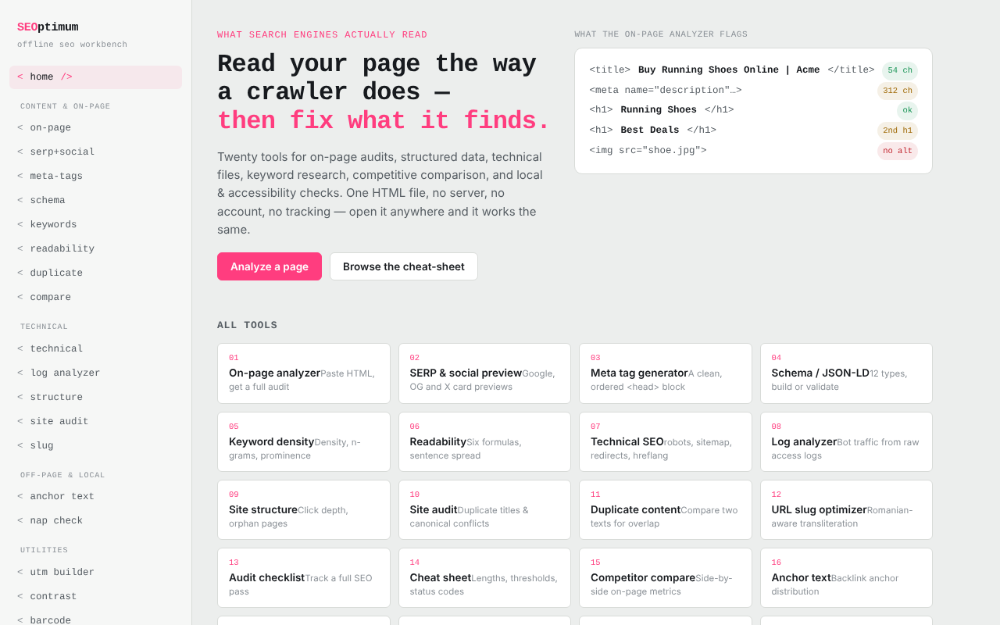

# SEOptimum

Atelier SEO într-un singur fișier HTML: douăzeci de unelte care rulează în browser.

**Live:** https://chiuta.github.io/SEOptimum/

## Ce este

SEOptimum („offline SEO workbench”) reunește unelte pentru audit on-page, date structurate, fișiere tehnice, conținut, SEO off-page și local. Analiza se face în fila browserului, pe textul sau HTML-ul pe care îl lipești; aplicația nu are conturi și nu are analytics. Interfața este disponibilă în engleză și română (butoanele „EN” / „RO”).

## Funcții

Meniul conține 20 de unelte, grupate astfel:

- **Content & on-page:** analizor on-page (titlu, headinguri, imagini, linkuri, meta, date structurate, cuvânt-cheie țintă), previzualizare SERP și social (Google desktop/mobil, Facebook/LinkedIn, X/Twitter), generator de meta-taguri, Schema / JSON-LD (construire și validare, previzualizare rich result), cercetare de cuvinte-cheie (densitate și n-grame, clustering, intenție și long-tail, canibalizare), lizibilitate (șase formule, verificare pentru featured snippet), verificator de conținut duplicat, comparare de competitori.
- **Technical:** fișiere tehnice (robots.txt, sitemap.xml, redirecturi, hreflang, llms.txt și alte fișiere generate în aplicație), analizor de loguri, structură internă și adâncime de click, audit de site, optimizator de slug-uri.
- **Off-page & local:** analizor de anchor text, verificator de consistență NAP.
- **Utilities:** constructor UTM, verificator de contrast WCAG 2.2, validator GTIN / cod de bare (UPC-A, EAN-8, EAN-13, GTIN-14).
- **Reference:** listă de verificare SEO (export Markdown) și fișă de referință.
- Export raport on-page (`on-page-report.md`) și tipărire.

## Manual de utilizare

1. Deschide pagina și alege limba cu „EN” / „RO”; tema se poate schimba din antet.
2. Din meniul din stânga alege o unealtă (de exemplu `<on-page/>`).
3. În analizorul on-page lipește sursa HTML a paginii (în browser: Ctrl/Cmd+U, copiază) în „Page HTML source”, opțional completează „Focus keyword” și apasă „Analyze”.
4. Opțional, completează „Page URL” și apasă „Try fetch” pentru a încerca descărcarea directă; majoritatea site-urilor blochează cererea (CORS), caz în care folosești lipirea manuală.
5. Folosește „Export report” pentru a descărca raportul `.md` sau „Print report”.
6. În generatoare (meta, schema, UTM etc.) completează câmpurile și apasă „Copy”.
7. La UTM builder, „Save to list” păstrează linkurile salvate în acest browser.
8. În „SEO audit checklist” bifează punctele; starea se păstrează local, iar exportul produce `seo-checklist.md`.

## Confidențialitate și rețea

- **Stocare locală:** `localStorage`, chei cu prefixul `seoFF.` (limbă, temă, listă UTM salvată, starea checklist-ului).
- **Rețea:** aplicația face cereri doar la acțiuni explicite ale utilizatorului: butonul „Try fetch” (`fetch` către URL-ul introdus de tine, către orice site) și previzualizarea unei imagini `og:image` indicate prin URL (browserul încarcă imaginea de la acel URL). Politica CSP din pagină permite aceste conexiuni (`connect-src *`, `img-src https: http:`). În rest, analiza are loc local; nu există CDN, fonturi externe sau analytics.
- Domeniile `example.com`, `schema.org` etc. din cod apar ca exemple sau identificatori de vocabular, nu ca resurse încărcate.

## Rulare locală / offline

Descarcă `index.html` și deschide-l în browser; funcționează fără internet. Doar „Try fetch” și previzualizarea imaginilor la distanță au nevoie de conexiune.

## Licență

Licența nu este încă declarată explicit în acest repository; vezi nota din aplicație (aplicația nu conține o declarație de licență proprie).

## Autor

Alexio — Alexandru-Ionuț Chiuță, contact: alexio@trom.tf

## English summary

SEOptimum is a single-file SEO workbench with 20 tools (on-page analyzer, SERP/social preview, meta and JSON-LD generators, keyword research, readability, robots/sitemap/hreflang/llms.txt, log analyzer, site audit, UTM builder, WCAG contrast, GTIN validator, checklist). English/Romanian UI. Analysis runs locally; the network is used only for the optional "Try fetch" button and remote og:image previews. Preferences are stored in localStorage (`seoFF.` keys).
